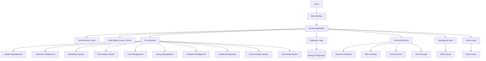

# Smart School Management System - Architecture Plan

## Project Overview

A comprehensive school management system built with PHP/Laravel that provides complete administrative, academic, and financial management capabilities for educational institutions. The system supports multiple user roles (Admin, Teacher, Student, Parent, Accountant, Librarian) with role-specific dashboards and functionalities.

## Technology Stack

### Backend
- **Framework**: Laravel 11.x (latest stable)
- **PHP Version**: 8.2+
- **Database**: MySQL 8.0+ / PostgreSQL 14+
- **ORM**: Eloquent ORM
- **Authentication**: Laravel Sanctum (API) / Laravel Breeze (Web)
- **Queue**: Redis + Laravel Queues
- **Cache**: Redis
- **File Storage**: Local / S3 / DigitalOcean Spaces

### Frontend
- **UI Framework**: Bootstrap 5.3+ / Tailwind CSS 3.x
- **JavaScript**: Alpine.js / Vue.js 3 (for interactive components)
- **Template Engine**: Blade Templates
- **Icons**: FontAwesome / Heroicons
- **Charts**: Chart.js / ApexCharts

### Third-Party Integrations
- **Payment Gateways**: Razorpay, PayPal, Stripe
- **SMS Gateway**: Twilio, Clickatell, Custom HTTP Gateway
- **Email**: SMTP, SendGrid, Mailgun
- **PDF Generation**: DomPDF / Snappy
- **Excel Export**: Laravel Excel (PHPSpreadsheet)
- **Backup**: Laravel Backup Package (spatie/laravel-backup)

## System Architecture



## Database Schema Design

### Core Tables

#### Users & Authentication
- `users` - Main user table with role-based access
- `roles` - User roles (admin, teacher, student, parent, accountant, librarian)
- `permissions` - Granular permissions
- `role_user` - Pivot table for user-role relationships
- `permission_role` - Pivot table for role-permission relationships
- `password_resets` - Password reset tokens

#### Academic Structure
- `academic_sessions` - Academic years/sessions
- `classes` - Classes/Grades (Class 1, Class 2, etc.)
- `sections` - Sections within classes (A, B, C, etc.)
- `subjects` - Subjects with codes and types (theory/practical)
- `class_subjects` - Subject assignment to classes
- `class_sections` - Section assignment to classes
- `class_timetables` - Weekly timetables with periods

#### Student Management
- `students` - Student profiles and basic information
- `student_siblings` - Sibling relationships
- `student_documents` - Student document uploads
- `student_categories` - Student categories (caste, skill, etc.)
- `student_admissions` - Admission records
- `student_promotions` - Promotion history

#### Attendance System
- `attendances` - Daily attendance records
- `attendance_types` - Attendance types (present, absent, late, etc.)

#### Examination System
- `exams` - Exam definitions
- `exam_schedules` - Exam schedules with dates and times
- `exam_types` - Exam types (midterm, final, etc.)
- `exam_marks` - Student marks
- `exam_grades` - Grade definitions
- `exam_attendance` - Exam attendance records

#### Fees Management
- `fees_types` - Fee types (tuition, library, transport, etc.)
- `fees_groups` - Fee groups
- `fees_masters` - Fee configuration
- `fees_discounts` - Discount rules
- `fees_allotments` - Fee allotments to students
- `fees_transactions` - Payment transactions
- `fees_fines` - Fine configurations
- `fees_invoices` - Fee invoices

#### Library Management
- `library_books` - Book inventory
- `library_categories` - Book categories
- `library_members` - Library members (students/teachers)
- `library_issues` - Book issue/return records
- `library_returns` - Book return records

#### Transport Management
- `transport_vehicles` - School vehicles/buses
- `transport_routes` - Bus routes
- `transport_route_stops` - Route stops
- `transport_assignments` - Vehicle-route assignments
- `transport_students` - Student transport assignments

#### Hostel Management
- `hostels` - Hostel information
- `hostel_rooms` - Room details
- `hostel_room_types` - Room types
- `hostel_assignments` - Student hostel assignments

#### Communication System
- `notices` - Notice board announcements
- `messages` - Internal messaging system
- `message_recipients` - Message recipients
- `sms_logs` - SMS sending logs
- `email_logs` - Email sending logs

#### Accounting System
- `expenses` - School expenses
- `expense_categories` - Expense categories
- `income` - Income records
- `income_categories` - Income categories
- `transactions` - Financial transactions

#### Settings & Configuration
- `settings` - System settings
- `languages` - Supported languages
- `translations` - Language translations
- `backups` - Backup records

#### Downloads & Resources
- `downloads` - Downloadable content
- `homework` - Homework assignments
- `study_materials` - Study materials

## Module Breakdown

### 1. Authentication & Authorization Module
**Features:**
- Multi-role authentication (6 roles)
- Role-based access control (RBAC)
- Permission management
- Password reset functionality
- Remember me functionality
- Session management
- Two-factor authentication (optional)

**Key Components:**
- Login/Logout functionality
- Registration (for students/parents)
- Profile management
- Password change
- API authentication (Sanctum)

### 2. Dashboard Module
**Features:**
- Role-specific dashboards
- Key metrics and statistics
- Charts and graphs
- Recent activities
- Quick actions
- Notifications

**Dashboard Types:**
- Admin Dashboard
- Teacher Dashboard
- Student Dashboard
- Parent Dashboard
- Accountant Dashboard
- Librarian Dashboard

### 3. Student Management Module
**Features:**
- Student admission with 40+ fields
- Student profiles
- Sibling management
- Student categories
- Student documents
- Student search (by name, admission no, father name, etc.)
- Student reports
- Student promotion/demotion
- Student transfer/leaving

**Key Forms:**
- Admission form
- Profile update form
- Sibling addition form
- Document upload form

### 4. Academic Management Module
**Features:**
- Academic session management
- Class/Grade management
- Section management
- Subject management
- Class-Section organization
- Subject assignment to classes
- Class timetable creation

**Key Components:**
- Class creation
- Section creation
- Subject creation
- Timetable scheduler
- Academic session management

### 5. Attendance Management Module
**Features:**
- Daily attendance marking
- Monthly attendance reports
- Class-wise attendance
- Attendance statistics
- Attendance notifications to parents

**Key Components:**
- Attendance marking interface
- Attendance reports
- Attendance calendar view

### 6. Examination Management Module
**Features:**
- Exam creation and configuration
- Exam scheduling
- Marks entry
- Grade management
- Progress reports
- Exam attendance
- Exam room management
- Marksheets generation

**Key Components:**
- Exam creation form
- Exam scheduler
- Marks entry interface
- Report card generator
- Grade configuration

### 7. Fees Management Module
**Features:**
- Fee types and groups
- Fee master configuration
- Fee discount management
- Fee allotment (class-wise or individual)
- Fee collection
- Payment processing (online/offline)
- Fee invoices
- Fee statements
- Balance reports
- Transaction reports
- Fine management
- Due date management

**Key Components:**
- Fee configuration
- Fee allotment
- Fee collection interface
- Payment gateway integration
- Fee reports

### 8. Library Management Module
**Features:**
- Book inventory management
- Book categories
- Library members (students/teachers)
- Book issue/return
- Fine calculation
- Book search
- Library reports

**Key Components:**
- Book management
- Member management
- Issue/return system
- Fine calculation

### 9. Transport Management Module
**Features:**
- Vehicle management
- Route management
- Route stops
- Driver details
- Student transport assignment
- Transport fees
- Transport reports

**Key Components:**
- Vehicle management
- Route management
- Student assignment

### 10. Hostel Management Module
**Features:**
- Hostel management
- Room management
- Room types
- Student hostel assignment
- Hostel fees
- Hostel reports

**Key Components:**
- Hostel management
- Room management
- Student assignment

### 11. Communication Module
**Features:**
- Notice board
- Internal messaging
- SMS notifications
- Email notifications
- Push notifications (optional)
- Communication logs

**Key Components:**
- Notice creation
- Messaging system
- SMS gateway integration
- Email engine integration

### 12. Accounting Module
**Features:**
- Expense tracking
- Income tracking
- Transaction management
- Category management
- Financial reports
- Chart/graph analysis
- Fee reconciliation

**Key Components:**
- Expense entry
- Income entry
- Transaction management
- Financial reports

### 13. Report Generation Module
**Features:**
- PDF export
- Excel export
- CSV export
- Print functionality
- Custom reports
- Scheduled reports

**Key Components:**
- Report generator
- Export functionality
- Print functionality

### 14. Multi-language Module
**Features:**
- Support for 73+ languages
- RTL support for Arabic
- Language switcher
- Translation management
- Language-specific content

**Key Components:**
- Language management
- Translation system
- RTL support

### 15. Backup & Restore Module
**Features:**
- Database backup
- File backup
- Scheduled backups
- Restore functionality
- Backup download
- Cloud storage integration

**Key Components:**
- Backup scheduler
- Restore functionality
- Backup management

### 16. Settings Module
**Features:**
- School settings (name, address, logo, etc.)
- Academic session settings
- System configuration
- Payment gateway settings
- SMS gateway settings
- Email settings
- Theme settings

**Key Components:**
- General settings
- Integration settings
- System settings

## User Roles and Permissions

### 1. Admin (Super Admin)
**Full Access:**
- All modules and features
- User management
- System configuration
- Settings management
- Backup/restore
- Report generation

### 2. Teacher
**Access:**
- View assigned classes and subjects
- Take attendance
- Enter exam marks
- View student profiles
- Send messages to students/parents
- View timetable
- Library access (issue books)
- Download study materials

### 3. Student
**Access:**
- View profile
- View attendance
- View exam marks
- View timetable
- View notices
- Download study materials
- Pay fees online
- View library books
- Send messages to teachers

### 4. Parent
**Access:**
- View all children's profiles
- View children's attendance
- View children's exam marks
- View children's fees
- Pay fees online
- View notices
- Send messages to teachers
- Monitor children's activities

### 5. Accountant
**Access:**
- Manage fees collection
- View fee reports
- Manage expenses
- View financial reports
- Process payments
- Generate fee invoices

### 6. Librarian
**Access:**
- Manage library books
- Manage library members
- Issue/return books
- Manage book categories
- View library reports
- Calculate fines

## API Structure

### Authentication Endpoints
```
POST /api/login
POST /api/logout
POST /api/register
POST /api/forgot-password
POST /api/reset-password
GET /api/user
```

### Student Management Endpoints
```
GET /api/students
POST /api/students
GET /api/students/{id}
PUT /api/students/{id}
DELETE /api/students/{id}
GET /api/students/search
POST /api/students/{id}/promote
```

### Academic Management Endpoints
```
GET /api/classes
POST /api/classes
GET /api/sections
POST /api/sections
GET /api/subjects
POST /api/subjects
GET /api/timetable
POST /api/timetable
```

### Attendance Endpoints
```
GET /api/attendance
POST /api/attendance
GET /api/attendance/report
```

### Examination Endpoints
```
GET /api/exams
POST /api/exams
GET /api/exams/{id}/marks
POST /api/exams/{id}/marks
GET /api/exams/report
```

### Fees Endpoints
```
GET /api/fees/types
POST /api/fees/types
GET /api/fees/invoices
POST /api/fees/pay
GET /api/fees/report
```

### Library Endpoints
```
GET /api/library/books
POST /api/library/books
POST /api/library/issue
POST /api/library/return
```

### Communication Endpoints
```
GET /api/notices
POST /api/notices
GET /api/messages
POST /api/messages
POST /api/notifications/send
```

## UI/UX Considerations

### Design Principles
1. **Responsive Design**: Works seamlessly on desktop, tablet, and mobile devices
2. **Clean Interface**: Modern, clean, and intuitive user interface
3. **Accessibility**: WCAG 2.1 AA compliance
4. **Performance**: Fast page loads and smooth interactions
5. **Consistency**: Consistent design language across all modules

### Color Scheme
- Primary: #4F46E5 (Indigo)
- Secondary: #10B981 (Emerald)
- Accent: #F59E0B (Amber)
- Background: #F9FAFB (Light Gray)
- Text: #111827 (Dark Gray)

### Typography
- Font Family: Inter / Poppins
- Headings: Bold, 600-700 weight
- Body: Regular, 400 weight
- Monospace: JetBrains Mono for code/numbers

### Layout Structure
- **Sidebar Navigation**: Collapsible sidebar with module links
- **Top Bar**: User profile, notifications, language switcher, theme toggle
- **Main Content Area**: Dynamic content based on selected module
- **Footer**: Copyright, quick links, version info

### Components
- Data Tables with pagination, sorting, and filtering
- Forms with validation
- Modals for quick actions
- Cards for displaying information
- Charts for data visualization
- Tabs for organizing content
- Breadcrumbs for navigation
- Loading states and skeletons
- Toast notifications for feedback
- Confirmation dialogs for destructive actions

## Security Considerations

### Authentication & Authorization
- Secure password hashing (bcrypt)
- Session management with expiration
- CSRF protection
- XSS protection
- SQL injection prevention (parameterized queries)
- Rate limiting on API endpoints
- Input validation and sanitization

### Data Protection
- Encryption of sensitive data
- Secure file uploads (validation, sanitization)
- Regular security audits
- HTTPS enforcement
- Secure headers (CSP, HSTS, X-Frame-Options)

### Privacy
- GDPR compliance
- Data retention policies
- User consent management
- Data export functionality
- Right to be forgotten

### Backup & Recovery
- Automated daily backups
- Off-site backup storage
- Disaster recovery plan
- Regular backup testing

## Deployment Strategy

### Development Environment
- Local development with Laravel Valet / Laravel Sail
- Version control with Git
- Feature branch workflow
- Code review process

### Staging Environment
- Mirror production environment
- Automated testing
- Pre-deployment checks
- Client approval

### Production Environment
- Cloud hosting (AWS, DigitalOcean, Laravel Forge)
- Load balancing (if needed)
- CDN for static assets
- SSL certificate
- Monitoring and logging
- Automated backups

### CI/CD Pipeline
- Automated testing on push
- Automated deployment to staging
- Manual approval for production
- Rollback capability

## Performance Optimization

### Database Optimization
- Database indexing
- Query optimization
- Caching strategies (Redis)
- Database connection pooling

### Application Optimization
- Code optimization
- Lazy loading
- Eager loading for relationships
- Queue for background jobs
- Image optimization

### Frontend Optimization
- Asset minification
- Browser caching
- CDN for static assets
- Lazy loading images
- Code splitting

## Testing Strategy

### Unit Testing
- Model tests
- Service tests
- Utility tests

### Feature Testing
- Authentication tests
- CRUD operations tests
- Business logic tests

### Integration Testing
- API endpoint tests
- Database integration tests
- Third-party integration tests

### End-to-End Testing
- User flow tests
- Critical path tests
- Cross-browser testing

## Documentation

### Technical Documentation
- API documentation (Swagger/OpenAPI)
- Database schema documentation
- Code documentation (PHPDoc)
- Architecture documentation

### User Documentation
- User manual for each role
- Video tutorials
- FAQ section
- Troubleshooting guide

### Developer Documentation
- Setup guide
- Contribution guidelines
- Coding standards
- Deployment guide

## Future Enhancements

### Phase 2 Features
- Mobile apps (React Native/Flutter)
- Video conferencing integration
- Online classes management
- AI-powered analytics
- Predictive insights
- Advanced reporting

### Phase 3 Features
- Learning management system (LMS)
- Virtual classroom
- Parent-teacher meeting scheduling
- Alumni management
- Inventory management
- HR management
- Payroll system

## Conclusion

This architecture provides a comprehensive foundation for building a robust, scalable, and feature-rich school management system. The modular design allows for easy maintenance and future enhancements, while the Laravel framework ensures rapid development and best practices.

The system is designed to be:
- **User-friendly**: Intuitive interface for all user roles
- **Scalable**: Can handle multiple schools and large student populations
- **Secure**: Built-in security features and best practices
- **Flexible**: Customizable to meet specific school requirements
- **Maintainable**: Clean code structure and comprehensive documentation
