# Smart School Management System - Visual Overview

## System Architecture Diagram

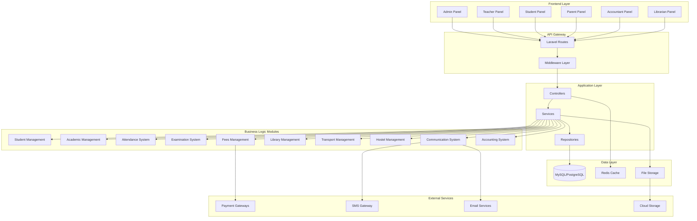

## User Role Hierarchy

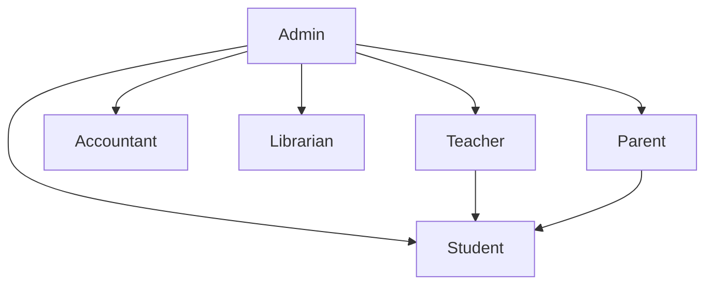

## Student Admission Flow

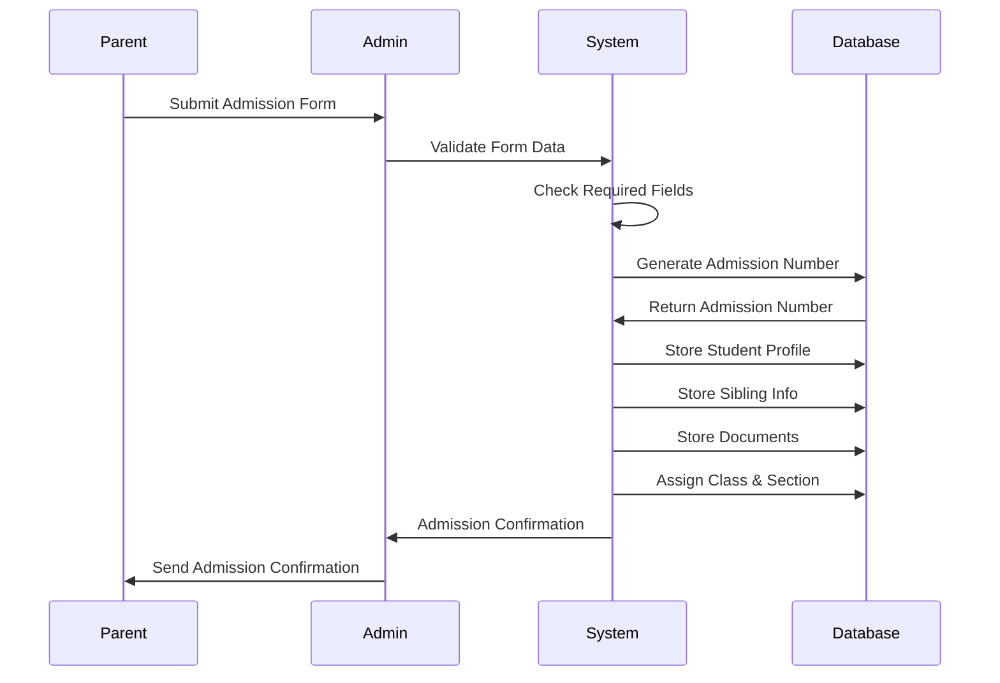

## Attendance Marking Flow

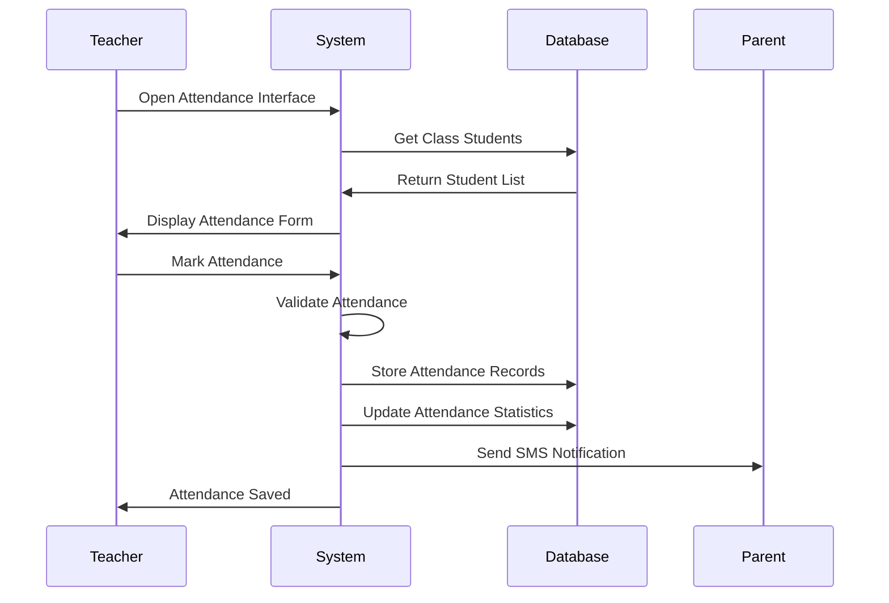

## Examination Management Flow

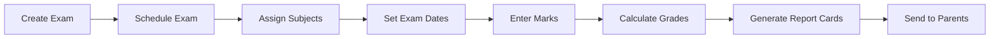

## Fees Collection Flow

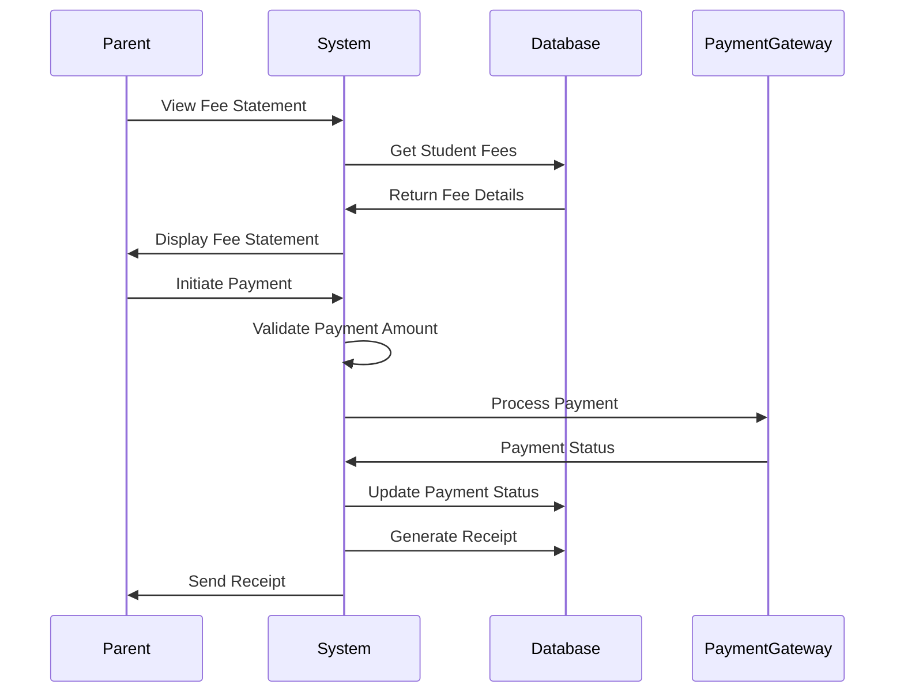

## Library Book Issue Flow

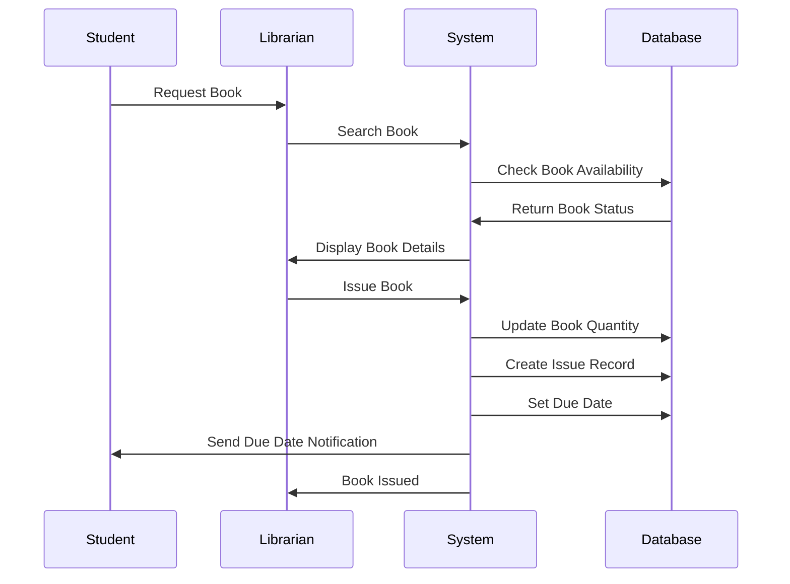

## Database Entity Relationships

```mermaid
erDiagram
    USERS ||--o{ STUDENTS : has
    USERS ||--o{ ATTENDANCES : marks
    USERS ||--o{ EXAM_MARKS : enters
    USERS ||--o{ FEES_TRANSACTIONS : processes
    USERS ||--o{ LIBRARY_ISSUES : issues
    
    ACADEMIC_SESSIONS ||--o{ CLASSES : contains
    ACADEMIC_SESSIONS ||--o{ STUDENTS : enrolls
    ACADEMIC_SESSIONS ||--o{ EXAMS : schedules
    
    CLASSES ||--o{ SECTIONS : has
    CLASSES ||--o{ STUDENTS : contains
    CLASSES ||--o{ CLASS_SUBJECTS : has
    CLASSES ||--o{ CLASS_TIMETABLES : has
    
    SECTIONS ||--o{ STUDENTS : contains
    SECTIONS ||--o{ ATTENDANCES : has
    
    SUBJECTS ||--o{ CLASS_SUBJECTS : assigned to
    SUBJECTS ||--o{ EXAM_SCHEDULES : in
    
    STUDENTS ||--o{ STUDENT_SIBLINGS : has
    STUDENTS ||--o{ STUDENT_DOCUMENTS : has
    STUDENTS ||--o{ ATTENDANCES : has
    STUDENTS ||--o{ EXAM_MARKS : has
    STUDENTS ||--o{ FEES_ALLOTMENTS : has
    STUDENTS ||--o{ FEES_TRANSACTIONS : has
    STUDENTS ||--o{ TRANSPORT_STUDENTS : has
    STUDENTS ||--o{ HOSTEL_ASSIGNMENTS : has
    
    EXAMS ||--o{ EXAM_SCHEDULES : has
    EXAM_SCHEDULES ||--o{ EXAM_ATTENDANCE : has
    EXAM_SCHEDULES ||--o{ EXAM_MARKS : has
    
    FEES_MASTERS ||--o{ FEES_ALLOTMENTS : creates
    FEES_ALLOTMENTS ||--o{ FEES_TRANSACTIONS : has
    
    LIBRARY_BOOKS ||--o{ LIBRARY_ISSUES : issued as
    LIBRARY_MEMBERS ||--o{ LIBRARY_ISSUES : borrows
    
    TRANSPORT_ROUTES ||--o{ TRANSPORT_VEHICLES : uses
    TRANSPORT_ROUTES ||--o{ TRANSPORT_ROUTE_STOPS : has
    TRANSPORT_ROUTES ||--o{ TRANSPORT_STUDENTS : serves
    
    HOSTELS ||--o{ HOSTEL_ROOMS : contains
    HOSTEL_ROOMS ||--o{ HOSTEL_ASSIGNMENTS : assigned to
```

## Module Dependencies

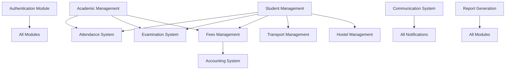

## Authentication Flow

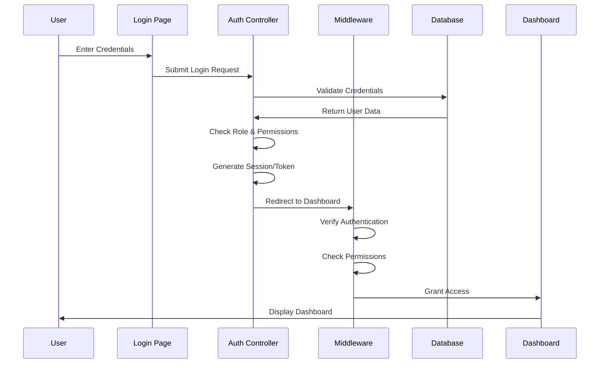

## Report Generation Flow

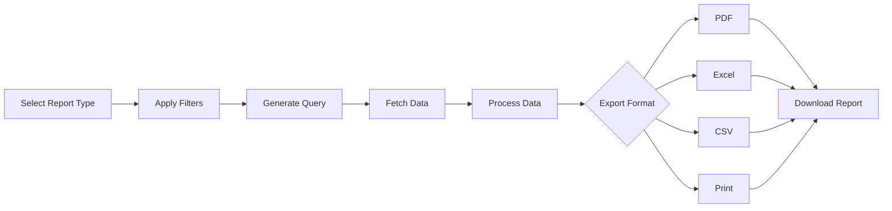

## Multi-language Support Flow

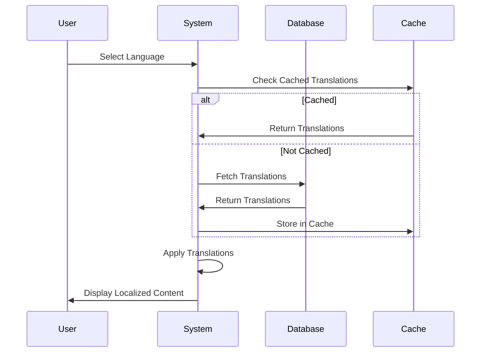

## Backup & Restore Flow

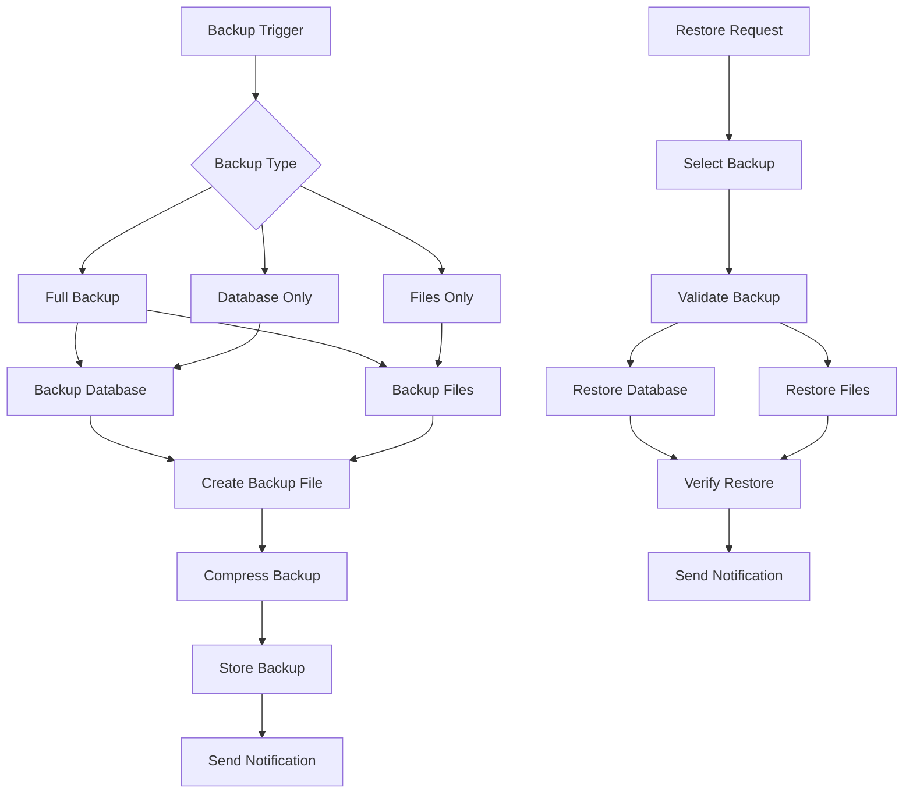

## Parent Monitoring Flow

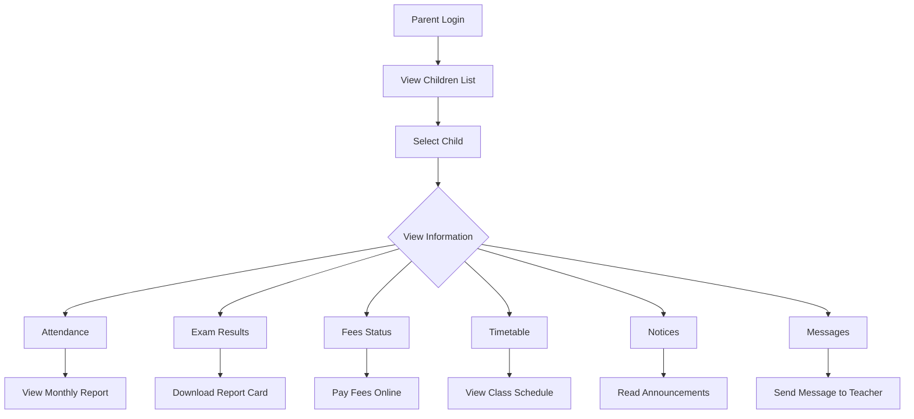

## System Deployment Architecture

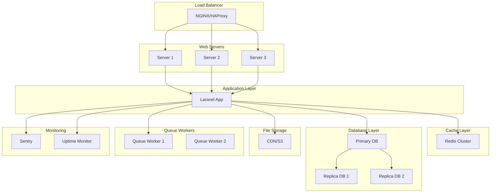

## API Request Flow

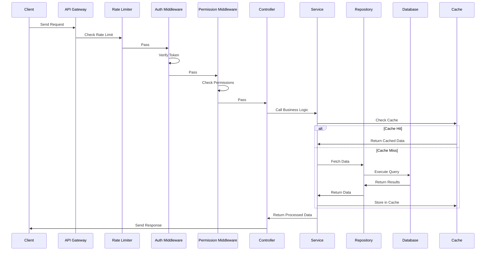

## Data Flow Diagram

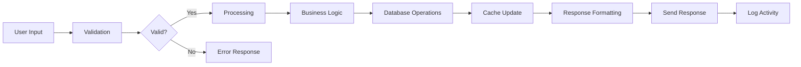

## Feature Priority Matrix

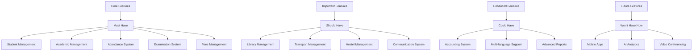

## Testing Pyramid

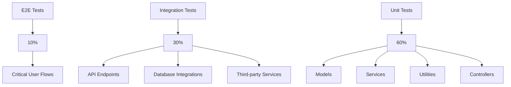

## Development Workflow

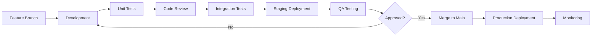

## CI/CD Pipeline

```mermaid
graph TB
    A[Code Push] --> B[Build]
    B --> C[Unit Tests]
    C --> D{Tests Pass?}
    D -->|No| E[Notify Developer]
    D -->|Yes| F[Code Quality Check]
    F --> G{Quality OK?}
    G -->|No| E
    G -->|Yes| H[Security Scan]
    H --> I{Secure?}
    I -->|No| E
    I -->|Yes| J[Build Docker Image]
    J --> K[Deploy to Staging]
    K --> L[Integration Tests]
    L --> M{Tests Pass?}
    M -->|No| E
    M -->|Yes| N[Manual Approval]
    N --> O{Approved?}
    O -->|No| E
    O -->|Yes| P[Deploy to Production]
    P --> Q[Health Check]
    Q --> R{Healthy?}
    R -->|No| S[Rollback]
    R -->|Yes| T[Complete]
```

## System Monitoring Flow

```mermaid
graph LR
    A[Application Metrics] --> B[Prometheus]
    C[Error Tracking] --> D[Sentry]
    E[Uptime Monitoring] --> F[UptimeRobot]
    
    B --> G[Grafana Dashboard]
    D --> G
    F --> G
    
    G --> H[Alerts]
    H --> I[Email]
    H --> J[Slack]
    H --> K[SMS]
    
    I --> L[DevOps Team]
    J --> L
    K --> L
```

## Data Backup Strategy

```mermaid
graph TB
    A[Automated Backups] --> B[Daily Incremental]
    A --> C[Weekly Full]
    A --> D[Monthly Archive]
    
    B --> E[Local Storage]
    C --> E
    D --> E
    
    E --> F[Cloud Storage]
    F --> G[AWS S3]
    F --> H[DigitalOcean Spaces]
    
    G --> I[Retention Policy]
    H --> I
    
    I --> J[7 Days Daily]
    I --> K[4 Weeks Weekly]
    I --> L[12 Months Monthly]
    
    J --> M[Auto Delete]
    K --> M
    L --> M
```

## Security Layers

```mermaid
graph TB
    A[Network Security] --> B[Firewall]
    B --> C[DDoS Protection]
    
    D[Application Security] --> E[Authentication]
    E --> F[Authorization]
    F --> G[Input Validation]
    G --> H[XSS Protection]
    H --> I[CSRF Protection]
    I --> J[SQL Injection Prevention]
    
    K[Data Security] --> L[Encryption]
    L --> M[Secure Headers]
    M --> N[HTTPS Only]
    
    O[Monitoring] --> P[Security Audits]
    P --> Q[Vulnerability Scanning]
    Q --> R[Intrusion Detection]
```

## Performance Optimization

```mermaid
graph LR
    A[Database Optimization] --> B[Indexing]
    A --> C[Query Optimization]
    A --> D[Connection Pooling]
    
    E[Caching Strategy] --> F[Redis Cache]
    E --> G[Query Result Cache]
    E --> H[Page Cache]
    
    I[Frontend Optimization] --> J[Asset Minification]
    I --> K[Image Optimization]
    I --> L[Lazy Loading]
    I --> M[CDN]
    
    N[Application Optimization] --> O[Code Optimization]
    N --> P[Queue System]
    N --> Q[Background Jobs]
```

## Scalability Architecture

```mermaid
graph TB
    A[Horizontal Scaling] --> B[Load Balancer]
    B --> C[Multiple Web Servers]
    
    D[Vertical Scaling] --> E[Upgrade Server Resources]
    
    F[Database Scaling] --> G[Read Replicas]
    G --> H[Database Sharding]
    
    I[Cache Scaling] --> J[Redis Cluster]
    
    K[Storage Scaling] --> L[CDN]
    L --> M[Cloud Storage]
    
    N[Queue Scaling] --> O[Multiple Queue Workers]
```

## Conclusion

This visual overview provides comprehensive diagrams for understanding the Smart School Management System architecture, workflows, and various system components. These diagrams serve as visual aids for developers, stakeholders, and anyone involved in the project.

For detailed technical specifications, refer to:
- [Architecture Plan](./school-management-system-architecture.md)
- [Implementation Roadmap](./school-management-implementation-roadmap.md)
- [Database Schema](./school-management-database-schema.md)
- [Quick Start Guide](./school-management-quick-start.md)
